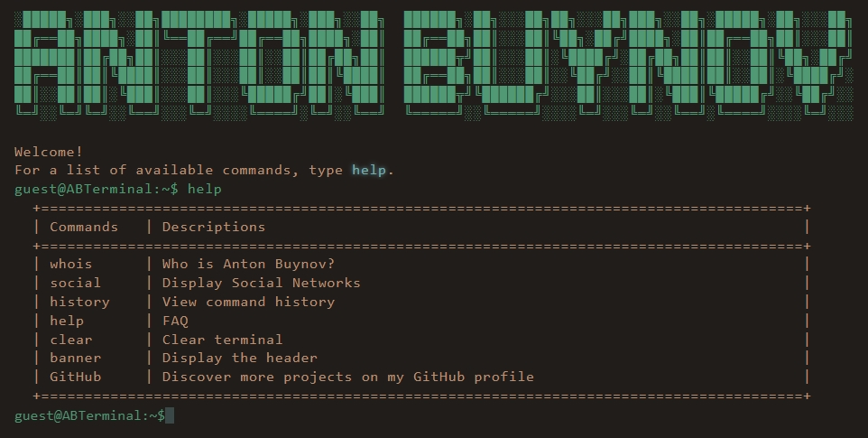

<h1 align="center">Web Terminal</h1>

This website is built with simple HTML, CSS, and JavaScript.
 
You can access the website by clicking [GitHub profile](https://www.ibuynov.ru/).

## Getting Started

To access this website, simply click on the link provided above. Once you land on the page, you will see a terminal interface where you can interact with the website.

You can type `help` to see a list of available commands.

## Features

- Simple terminal interface
- Interactive commands

## Commands

Here is a list of available commands:

- `whois`: Displays a brief introduction about me
- `social`: Display Social Networks
- `history`: View command history
- `help`: Display a list of available commands
- `clear`: Clear terminal
- `banner`: Display the header
- `GitHub`: Discover more projects on my GitHub profile

## License

This project is licensed under the [MIT License](https://opensource.org/license/mit/) - see the LICENSE file for details.
